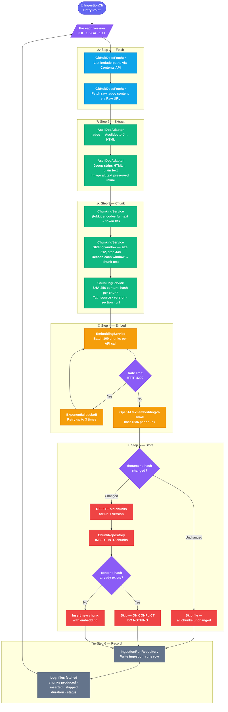

# Ingestion Pipeline

The ingestion pipeline is a one-time CLI process that fetches Spring AI documentation
from GitHub, processes it into searchable chunks, generates embeddings, and loads
everything into the PostgreSQL `chunks` table.

It runs independently of the API and can be safely re-run whenever documentation is updated.

---

## Pipeline Flow



---

## Step-by-step explanation

### Step 1 — Fetch

**Class:** `GitHubDocsFetcher`

Calls the GitHub REST API to retrieve `.adoc` files for each configured version.

Two API calls per file:

| Call | URL | Purpose |
|---|---|---|
| Contents API | `GET https://api.github.com/repos/spring-projects/spring-ai/contents/{path}?ref={branch}` | List files in a directory |
| Raw URL | `GET https://raw.githubusercontent.com/spring-projects/spring-ai/{branch}/{path}` | Fetch raw `.adoc` content |

Only files in `include-paths` are fetched. Files in `exclude-files` are skipped.

---

### Step 2 — Extract

**Class:** `AsciiDocAdapter` (implements `DocumentAdapter`)

Converts raw `.adoc` markup into clean plain text:

1. **AsciidoctorJ** converts `.adoc` → HTML — handles all AsciiDoc features correctly
2. Image macros (`image::file.png[alt text]`) → replaced with `[Image: alt text]` inline
3. **Jsoup** strips remaining HTML tags → clean plain text
4. Whitespace normalised

Result: searchable plain text with no markup noise.

---

### Step 3 — Chunk

**Class:** `ChunkingService`

Splits the full document text into overlapping token windows:

```
Full text encoded to token IDs by jtokkit (cl100k_base — same as text-embedding-3-small)

Sliding window:
  window size = 512 tokens
  step size   = 448 tokens  (512 - 64 overlap)

Example — 2,000 token document:
  Chunk 1: tokens    0 →  512
  Chunk 2: tokens  448 →  960
  Chunk 3: tokens  896 → 1,408
  Chunk 4: tokens 1,344 → 1,856
  Chunk 5: tokens 1,792 → 2,000  ← last chunk, smaller than 512
```

Each chunk is tagged with:
- `source` — `SPRING_AI_GITHUB`
- `version` — e.g. `1.0-GA`
- `section` — derived from filename e.g. `chatclient`
- `url` — GitHub `html_url` of the source file
- `contentHash` — SHA-256 of chunk text (used for idempotent upsert)

---

### Step 4 — Embed

**Class:** `EmbeddingService`

Generates a 1536-dimensional vector for each chunk using OpenAI `text-embedding-3-small`.

- Chunks are sent in batches of 100 per API call
- HTTP 429 (rate limit) triggers exponential backoff and retry (up to 3 attempts)
- HTTP 5xx triggers retry (up to 3 attempts), then fails the run

---

### Step 5 — Store

**Class:** `ChunkRepository`

Two-level idempotency:

**Document level (`document_hash`):**
- `document_hash` = SHA-256 of the full source `.adoc` file content
- If `document_hash` is unchanged → skip the entire file (all chunks are identical)
- If `document_hash` changed → DELETE all existing chunks for that `url + version`, then re-chunk, re-embed, and insert fresh chunks

**Chunk level (`content_hash`):**
- Persists each chunk using `ON CONFLICT (content_hash) DO NOTHING`
- Guards against partial re-runs and duplicate inserts

This two-level strategy ensures stale chunks never accumulate when a document is updated.

---

### Step 6 — Record

**Class:** `IngestionRunRepository`

Writes one row to `ingestion_runs` per version processed:

| Field | Value |
|---|---|
| `source` | `spring-ai-github` |
| `version` | e.g. `1.0-GA` |
| `branch` | e.g. `1.0.x` |
| `files_fetched` | total files retrieved from GitHub |
| `chunks_produced` | total chunks after splitting |
| `chunks_inserted` | new chunks written to DB |
| `chunks_skipped` | chunks already in DB, skipped |
| `duration_ms` | total time for this version |
| `status` | `SUCCESS` or `FAILED` |
| `error_message` | populated if `FAILED` |

---

## Error handling

| Scenario | Behaviour |
|---|---|
| GitHub API rate limit (HTTP 429) | Exponential backoff, retry up to 3 times |
| GitHub API failure (HTTP 5xx) | Retry up to 3 times, then fail the run |
| OpenAI rate limit (HTTP 429) | Exponential backoff, retry up to 3 times |
| OpenAI failure | Retry up to 3 times, then fail the run |
| `document_hash` unchanged | Skip entire file — all chunks already in DB |
| `document_hash` changed | DELETE old chunks for url+version, re-chunk and re-embed |
| `content_hash` conflict | Skip silently — `ON CONFLICT DO NOTHING` |
| Run fails mid-way | Already-inserted chunks remain. Next run skips them and continues naturally |

---

## Configuration reference

```yaml
atlas:
  ingestion:
    chunk-size: 512           # tokens per chunk
    chunk-overlap: 64         # overlap tokens between consecutive chunks
    batch-size: 100           # chunks per OpenAI embedding API call
    github:
      owner: spring-projects
      repo: spring-ai
      docs-path: spring-ai-docs/src/main/antora/modules/ROOT/pages
      token: ${GITHUB_TOKEN}  # personal access token — 5,000 requests/hour
      versions:
        - label: "0.8"
          branch: "0.8.x"
        - label: "1.0-GA"
          branch: "1.0.x"
        - label: "1.1+"
          branch: "1.1.x"
      include-paths:
        - api
        - guides
        - concepts.adoc
        - getting-started.adoc
        - upgrade-notes.adoc
      exclude-files:
        - contribution-guidelines.adoc
        - index.adoc
```

---

## Running the pipeline

```bash
# Set environment variables (or use .env file)
export GITHUB_TOKEN=your_token
export OPENAI_API_KEY=your_key
export DB_URL=jdbc:postgresql://localhost:5432/atlas
export DB_USERNAME=roms_user
export DB_PASSWORD=roms_pass

# Run ingestion
mvn exec:java -pl atlas-ingestion
```

Expected console output:

```
[INFO] Starting ingestion — version: 0.8, branch: 0.8.x
[INFO] Fetched 45 files from GitHub
[INFO] Chunking complete — 512 chunks produced
[INFO] Embedding batch 1/6 — chunks 1-100
[INFO] Embedding batch 2/6 — chunks 101-200
...
[INFO] Inserted 498 chunks, skipped 14 (already existed)
[INFO] Ingestion complete — version: 0.8 — duration: 38s — status: SUCCESS

[INFO] Starting ingestion — version: 1.0-GA, branch: 1.0.x
...
```
