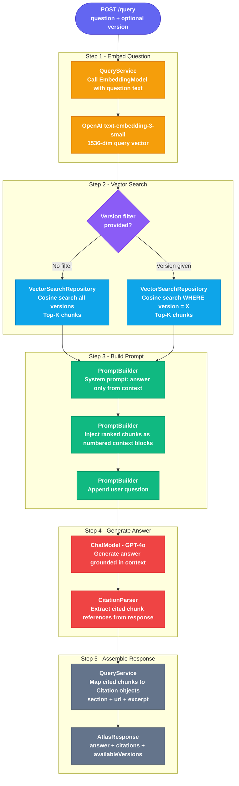

# Query Pipeline — atlas-query

The query module is a Spring Boot REST API that accepts a natural language question,
retrieves the most relevant chunks from the knowledge base using vector similarity search,
and returns a grounded answer with citations.

It is entirely read-only — it never writes to the `chunks` table.

---

## Pipeline Flow



---

## Steps in Detail

### Step 1 — Embed Question

The user's question is passed to the same embedding model used at ingestion time:
`text-embedding-3-small` (1536 dimensions, `cl100k_base` tokeniser).

Using the same model is critical — the query vector must live in the same latent space
as the chunk vectors. Mixing models produces meaningless similarity scores.

**Class:** `QueryService`
**Output:** `float[]` of length 1536

---

### Step 2 — Vector Similarity Search

The query vector is compared against every chunk embedding in the database using
**cosine similarity**. The top-K most similar chunks are returned.

```sql
SELECT id, source, version, section, url, content,
       1 - (embedding <=> ?::vector) AS score
FROM chunks
WHERE (:version IS NULL OR version = :version)
ORDER BY embedding <=> ?::vector
LIMIT :topK
```

- `<=>` is the pgvector cosine distance operator (0 = identical, 2 = opposite)
- `1 - distance` converts distance to similarity score (1.0 = perfect match)
- `topK` defaults to **8 chunks** — enough context without overflowing the prompt

**Version filtering:**
If the request includes a `version` field, the search is scoped to that version only.
If omitted, all 570 chunks across all versions are searched.

**Class:** `VectorSearchRepository`
**Output:** `List<ScoredChunk>` — chunk + cosine similarity score

---

### Step 3 — Build Prompt

The retrieved chunks are formatted into a structured prompt sent to the LLM.

**System prompt contract:**
- Answer using only the provided context — do not use external knowledge
- If the answer is not in the context, say so explicitly
- Cite sources using the format `[N]` where N is the chunk number
- Keep the answer concise and technically accurate

**Prompt structure:**

```
SYSTEM:
You are a technical assistant specialising in Spring AI documentation.
Answer the question using ONLY the context provided below.
Cite your sources using [1], [2] etc. matching the chunk numbers.
If the answer cannot be found in the context, say: "I could not find this in the Spring AI documentation."

CONTEXT:
[1] Section: chatclient | Version: 1.1 | Score: 0.91
<chunk text>

[2] Section: advisors | Version: 1.1 | Score: 0.87
<chunk text>

... (up to topK chunks)

USER:
How does ChatClient work in Spring AI 1.1?
```

**Class:** `PromptBuilder`
**Output:** `Prompt` (Spring AI prompt object)

---

### Step 4 — Generate Answer

The assembled prompt is sent to GPT-4o via Spring AI's `ChatModel` abstraction.

Model choice rationale:
- GPT-4o over GPT-3.5-turbo: significantly better at following citation instructions
  and staying grounded in provided context without hallucinating
- Spring AI `ChatModel` abstraction: swap model (Anthropic Claude, Gemini) with zero
  code changes — only config changes

The model returns a markdown response with inline `[N]` citations.

**Class:** `QueryService` (via Spring AI `ChatModel`)

---

### Step 5 — Parse Citations and Assemble Response

The `[N]` references in the model's response are matched back to the chunks retrieved
in Step 2. Each cited chunk becomes a `Citation` object.

**Citation fields:**
- `section` — the `.adoc` filename without extension (e.g. `chatclient`)
- `url` — direct GitHub link to the source file
- `excerpt` — the actual chunk text the model grounded its answer in

Uncited chunks (retrieved but not referenced by the model) are excluded from the
response — the user only sees sources the model actually used.

**Class:** `CitationParser`
**Output:** `List<Citation>`

**Final response:**

```json
{
  "answer": "ChatClient is a fluent API for interacting with AI models...",
  "citations": [
    {
      "section": "chatclient",
      "url": "https://raw.githubusercontent.com/spring-projects/spring-ai/1.1.x/docs/src/main/antora/modules/ROOT/pages/chatclient.adoc",
      "excerpt": "ChatClient offers a fluent API for communicating with an AI Model..."
    }
  ],
  "availableVersions": []
}
```

---

## Class Responsibilities

| Class | Package | Single responsibility |
|---|---|---|
| `QueryController` | `web` | Accept HTTP request, validate input, return HTTP response |
| `QueryService` | `service` | Orchestrate embed → search → prompt → generate → parse |
| `VectorSearchRepository` | `repository` | Execute pgvector cosine search via JDBC |
| `PromptBuilder` | `service` | Assemble system prompt + context chunks + user question |
| `CitationParser` | `service` | Extract `[N]` references from model output, map to chunks |
| `QueryConfig` | `config` | `@ConfigurationProperties` for topK, model name, max tokens |
| `ScoredChunk` | `repository` | Value object: chunk fields + cosine similarity score |

---

## Configuration

All tunable parameters live in `application.yml` under `atlas.query`:

```yaml
atlas:
  query:
    top-k: 8              # chunks retrieved per query
    model: gpt-4o         # chat model for answer generation
    max-tokens: 1024      # max tokens in the generated answer
    score-threshold: 0.70 # minimum cosine similarity to include a chunk
```

`score-threshold` is a quality gate — chunks below 0.70 similarity are dropped even if
they are in the top-K. This prevents low-quality context from polluting the answer when
the knowledge base has no good match for a question.

---

## REST API Contract

### POST /query

**Request:**
```json
{
  "question": "How does ChatClient work in Spring AI 1.1?",
  "version": "1.1"
}
```

| Field | Type | Required | Notes |
|---|---|---|---|
| `question` | string | yes | The user's natural language question |
| `version` | string | no | One of `1.0-GA`, `1.1`, `2.0-M`. Omit to search all versions |

**Response — 200 OK:**
```json
{
  "answer": "ChatClient is a fluent API...",
  "citations": [
    {
      "section": "chatclient",
      "url": "https://raw.githubusercontent.com/...",
      "excerpt": "ChatClient offers a fluent API..."
    }
  ],
  "availableVersions": []
}
```

**Response — 400 Bad Request:**
```json
{ "error": "question must not be blank" }
```

**Response — 404 Not Found:**
```json
{ "error": "No chunks found for version: 2.0-M" }
```

**Response — 500 Internal Server Error:**
```json
{ "error": "Failed to generate answer — please try again" }
```

---

## Idempotency and Statelessness

The query pipeline is fully stateless — every request is independent.
No session, no cache, no side effects. The same question always hits the DB fresh.

Future optimisation: add a response cache keyed on `SHA-256(question + version)`
to avoid redundant OpenAI calls for repeated questions. Not implemented in v1.

---

## Error Handling

| Failure | Behaviour |
|---|---|
| Empty question | 400 — rejected at controller validation |
| Unknown version label | 400 — rejected at controller validation |
| No chunks above score threshold | Return answer: "I could not find this in the documentation" with empty citations |
| OpenAI embedding API failure | 500 — log error, return generic message |
| OpenAI chat API failure | 500 — log error, return generic message |
| DB connection failure | 500 — Spring Boot default error handling |

---

## Module Dependencies

```
atlas-query
  ├── atlas-core          (AtlasQuery, AtlasResponse, Citation, Version, Chunk)
  ├── spring-boot-starter-web
  ├── spring-boot-starter-data-jpa
  ├── spring-ai-starter-model-openai  (EmbeddingModel + ChatModel)
  ├── postgresql (runtime)
  └── dotenv-java
```

`atlas-query` does **not** depend on `atlas-ingestion` — it shares only `atlas-core`.

---

## What is NOT in atlas-query

| Concern | Where it lives |
|---|---|
| Chunking logic | `atlas-ingestion` |
| Ingestion pipeline | `atlas-ingestion` |
| Agent / multi-turn loop | `atlas-agent` (future) |
| Evaluation scoring | `atlas-evals` (future) |
| MCP server | `atlas-mcp` (future) |
